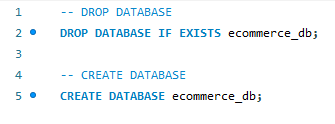

# eCommerce


## Description

This is a back end program that can be used as a back end for an e-commerce system. The API incorporates GET, PULL, PUSH, and PUT commands in regards to editing SQL tables such as Products, Tags and Categories. There is a video below for a walkthrough on it's functionality. 

## Table of Contents

- [Description](#description)
- [Installation](#installation)
- [Usage](#usage)
- [Contributing](#contributing)
- [Questions](#questions)

## Installation

1. Download repository

```
https://github.com/JosephCordell/eCommerce.git
```

2. Install Dependencies

```
npm install
```

3. Run the schema.sql code in your database



4. (optional) Install the seed via NPM for starter data

```
npm run seed
```

5. Run server.js

``` 
node server.js
```

## Usage

[Video Walkthrough](https://youtu.be/iY-lO8_pWMo)

#### View All Products 

View all of the products in the database via GET using "/api/products/"

#### View One Product

View a single product via GET using "/api/products/productID" where productID is the products ID number

#### Add Product

New product entry format via POST using "/api/products/"

```
    {
      "product_name": "PRODUCT NAME",
      "price": 800.00,
      "stock": 20,
      "tagIds": [3]
    }
```

#### Update Product

Update a single products details via PUT using "/api/products/productID" where productID is the products ID number

```
    {
      "product_name": "PRODUCT NAME",
      "price": 3000.00,
      "stock": 0
    }
```

#### Delete a Product

Delete a single product via DEL using  "/api/products/ProductID" productID is the products ID number

_________________________

#### View All Tags 

View all of the products in the database via GET using "/api/tags/"

#### View One Tag

View a single product via GET using "/api/tags/tagID" where tagID is the tags ID number

#### Add Tag

New product entry format via POST using "/api/tags/"

```
{
		"tag_name": "TAG NAME"
}
```

#### Update Tag

Update a single tags details via PUT using "/api/tags/tagID" where tagID is the tags ID number

```
{
		"tag_name": "UPDATED TAG NAME"
}
```

#### Delete a Tag

Delete a single product via DEL using  "/api/tags/tagID" where tagID is the tags ID number

_________________________

#### View All Categories 

View all of the products in the database via GET using "/api/categories/"

#### View One Category

View a single product via GET using "/api/categories/categoryID" where categoryID is the category ID number


#### Add Category

New product entry format via POST using "/api/categories/"

```
{
	"category_name": "CATEGORY NAME"
}
```

#### Update Category

Update a single categories details via PUT using "/api/categories/categoryID" where categoryID is the category ID number

```
{
	"category_name": "UPDATED CATEGORY NAME"
}
```

#### Delete a Category

Delete a single product via DEL using  "/api/products/categoryID" where categoryID is the category ID number


## Contribution

#### Contributors

[Joseph Cordell](https://github.com/JosephCordell),

## Questions

If you have any questions or see any issues, please submit an [issue](https://github.com/JosephCordell/eCommerce/issues) on GitHub!
